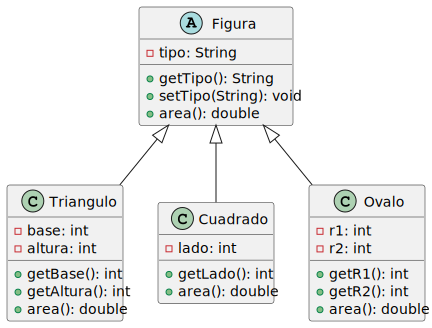

# Ejercicio de Encapsulamiento, herencia y polimorfismo - 2

Ejemplo de aplicación de encapsulamiento, herencia y polimorfismo. Usamos clase abstracta. 

- La clase Figura es abstracta y define un método abstracto area(), que debe ser implementado por las clases hijas Triangulo, Cuadrado y Ovalo. Esto permite que cada una de estas clases proporcione su propia implementación del cálculo del área.

## Diagrama de clases

<!--
https://gist.github.com/noamtamim/f11982b28602bd7e604c233fbe9d910f
Usar para generar con plantuml:
plantuml -tsvg README.md
-->

<!--
```
@startuml diagrama-clases.svg

abstract class Figura {
  - tipo: String
  + getTipo(): String
  + setTipo(String): void
  {abstract} + area(): double
}

class Triangulo {
  - base: int
  - altura: int
  + getBase(): int
  + getAltura(): int
  + area(): double
}

class Cuadrado {
  - lado: int
  + getLado(): int
  + area(): double
}

class Ovalo {
  - r1: int
  - r2: int
  + getR1(): int
  + getR2(): int
  + area(): double
}

Figura <|-- Triangulo
Figura <|-- Cuadrado
Figura <|-- Ovalo

@enduml
```
-->



## About :octocat:

:alien: **Author:** exercise were made by Norbey Danilo Muñoz Cañón and Universidad Distrital students.

:blue_book: **Thanks!**

> :bird: "Hazlo todo tan simple como sea posible, pero no más simple"
